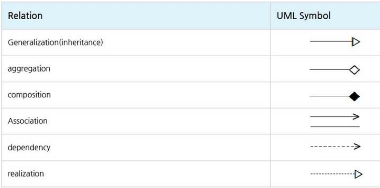
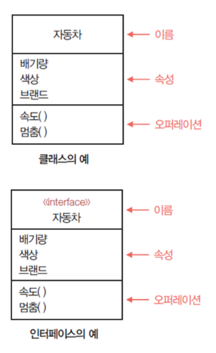
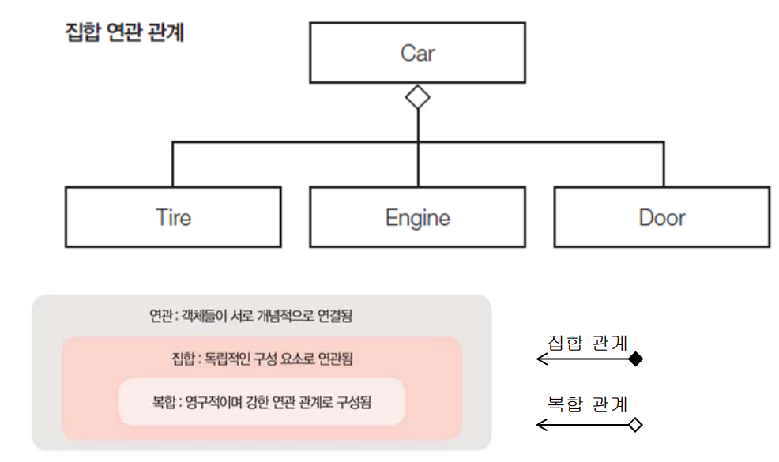
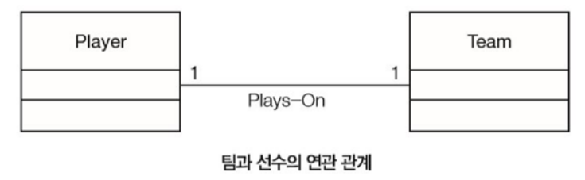
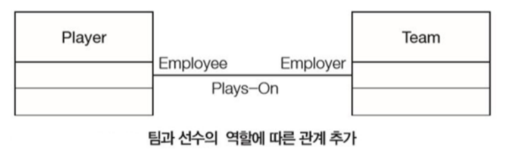
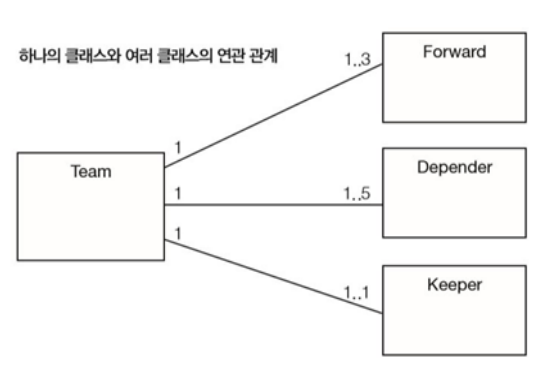
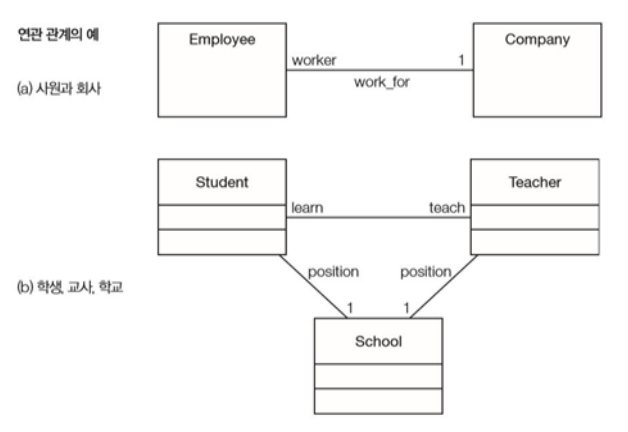
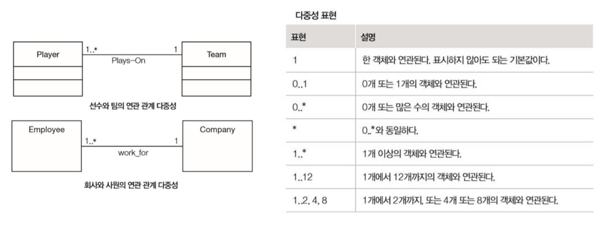

# UML ?

UML은 통합 모델링 언어(Unified Modeling Language)의 약자로 소프트 웨어 개발에서 시스템의 구조와
상호작용, 컴포넌트 관계, 객체 간의 메시지 전달, 업무 흐름 등을 표현하는 통합된 객체지향 개발 표준 통합
모델링 언어를 말합니다.

## UML 다이어그램 종류

1. 구조 다이어그램(Structure Diagram)
: 클래스 다이어그램, 객체 다이어그램, 복합체 구조 다이어그램, 배치 다이어그램, 컴포넌트 다이어그램, 패키지 다이어그램
2. 행위 다이어그램
: 유즈 케이스 다이어그램 , 활동 다이어그램, 상태 머신 다이어그램, 상호작용 다이어그램

## UML 구성 요소

[Class Diagram]
시스템의 논리적인 구조(클래스)를 정적으로 표현하는 대표적인 UML 구조 다이어그램입니다.
시스템을 구성 하는 클래스들 사이의 관계를 표현할 수 있습니다.

※ UML 클래스의 표현

1. 가장 윗부분 : 클래스 이름
2. 중간 부분 : 데이터 멤버(class field)
3. 마지막 부분 : 연산(method)
4. 접근 제어 지시자
  public : +
  private : -
  protected : #
  default(package) : ~ //동일 패키지에 있는 클래스의 객체들만 접근 가능함

5. 반환형 : 데이터 멤버 · 연산 선언 :(colon) 반환형
6. 추상 클래스 : `<<abstract>>` //스테레오 타입이며 이탤릭체로 표기합니다.
7. 인터페이스(interface) : `<<interface>>` //스테레오 타입
8. 다음은 클래스 사이의 관계를 나타내는 UML Symbol을 나타냅니다

## UML 관계 이해

1. 일반화 관계 (Generalization)
한 클래스가 다른 클래스를 포함하는 상위 개념일 때 두 클래스 사이에는 일반화 관계가
존재합니다. 객체지향 개념에서는 일반화 관계를 상속 관계(Inheritance)라고 합니다.
// 객체지향 개념에서의 일반화 관계(상속 관계) = 'is a' 관계
(예시) 학생은 사람이다.

2. 집합 관계(Aggregation)
한 객체가 다른 객체를 소유하는 관계입니다. 전체 객체의 라이프타임과 부분 객체의
라이프타임은 독립적입니다. 그러므로 전체 객체가 사라진다 해도 부분 객체는 사라지지
않습니다. '부분'을 나타내는 객체는 다른 객체와도 공유할 수 있습니다. // 객체지향 개념에서의 집합 관계 : 'has a' 관계
(예시) 학생은 가방을 소유하다.

3. 합성 관계(Composition)
부분 객체가 전체 객체에 속하는 관계로 관계가 긴밀하여 필수적인 관계입니다.
전체 객체의 라이프타임과 부분 객체의 라이프 타임은 의존적이다. 그러므로 전체 객체가
없어지면 부분 객체도 없어집니다. // 객체지향 개념에서의 합성 관계 : 'consist of' 관계
(예시) 자동차는 엔진으로 구성되다.

4. 연관 관계 (Association)
한 클래스가 다른 클래스와 연관 관계를 가지며 각 클래스의 객체는 서로 연결되었음을 나타냅니다.
보통은 한 클래스가 다른 클래스에서 제공하는 기능을 사용하는 상황일 때 표시합니다. // 객체지향 개념에서의 연관 관계 : “use a” 관계
  **연관 관계의 방향성**
    · 단방향 연관 관계 : 한쪽은 알지만 다른 쪽은 상대방의 존재를 모르는 관계입니다.
    (예시) 사람이 핸드폰을 사용한다.
    · 양방향 연관 관계 : 두 클래스의 객체들이 서로의 존재를 인식합니다.
    (예시) 학생들은 선생님과 상담한다.

5. 의존 관계(dependency)
연관 관계와 같이 일반적으로 한 클래스가 다른 클래스에서 제공하는 기능을 사용할 때를 나타냅니다.
연관 관계와의 차이점은 의존 관계는 한 클래스에서 메서드를 실행하는 동안과 같은,
짧은 시간만 사용되는 경우 입니다. // 객체지향 개념에서의 의존 관계 : “use a” 관계
  **연관 관계와 의존 관계의 구분**
    연관 관계 : 객체가 객체를 계속 사용하는 관계입니다.
    · 클래스의 속성(멤버 변수)에서 참조할 때 : (예시) 사람이 자동차를 사용하다.
    의존 관계 : 객체가 객체를 잠깐 사용하는 관계입니다.
    · 연산(메서드)의 '인자(참조값)'로 사용될 때
    · 메서드 내부의 '지역 객체'로 참조될 때 : (예시) 자동차가 주유기를 사용하다.

6. 실체화 관계(realization)
어떤 공통되는 능력이 있는 것들을 집합하여 외부에 제공하는 책임인 인터페이스와 이 책임들을 실제로
실현한 클래스들 사이의 관계입니다. //객체지향 개념에서의 실체화 관계 : “can do this”관계

## 클래스 다이어그램의 구성 요소와 표현

* 사물
 정적사물Structural Things
– 모델의 구조, 즉 개념적·물리적 요소를 표현하는 명사
– 클래스, 인터페이스, 통신, 컴포넌트, 패키지, 노드 등이 있다.
 클래스Class
– 동일한 속성, 오퍼레이션, 관계, 의미를 공유하는 객체를 기술한 것
– 직사각형 표시
 인터페이스Interface
– 클래스 또는 컴포넌트의 서비스를 명세화하는 오퍼레이션을 모아놓은 것
– 특정 클래스나 컴포넌트의 전체 또는 일부 동작을 나타낼 수 있음
– 원 표시

* 클래스의 구성 요소
 클래스는 클래스 이름, 속성, 메서드로 구성
 클래스class
– 공통의 속성, 메서드(오퍼레이션), 관계, 의미를 공유하는 객체 집합에 대한 기술
 속성attribute
– 클래스의 구조적 특성에 이름을 붙인 것
– 구조적 특성에 해당하는 인스턴스가 보유할 수 있는 값의 범위를 기술
– 영문 소문자로 시작함

## 주요 UML 구성 요소 이해(연관 관계)

* 관계
 연관Association 관계
 집합 연관
– 전체 쪽 객체 하나가 부분 쪽 객체들을 소유
– has-a 관계라고도 함

* 집합 관계의 복합 관계 : 집합 관계와 복합 관계는 연관관계에 포함

1. 집합 관계는 하나의 객체가 독립적인 객체 여러 개로 구성되는 경우
2. 복합 관계는 집합 관계보다 좀더 더 강한 관계로 구성되는 경우
3. 복합 관계는 단독 사용이 불가능하며 반드시 슈퍼 클래스와
함께 사용함

## 클래스 사이의 관계 표현

* 연관 관계
 연관 관계는 클래스 간에 서로 개념적으로 연결된 선으로 표현

 각 클래스에는 각각의 역할 role이 존재
 선수와 팀의 역할은 각각 피고용인 Employee과 고용인 Employer

## 클래스 사이의 관계 표현

연관 관계
 하나의 클래스는 여러 개의 클래스와 연관 관계를
가질 수 있음

 그림 (a)
– 사원과 회사가 서로 연관 관계로 연결될 수 있음
 그림 (b)
– 학생, 교사, 학교가 각각 다른 두 개체와 연관 관계에 놓임

## 연관 관계의 다중성

 다중성multiplicity
 클래스 사이에 연관 관계를 맺는 객체의 수가 1개 이상인 경우
 팀 쪽에 붙은 1은 기본값이므로 표현하지 않아도 괜찮음

